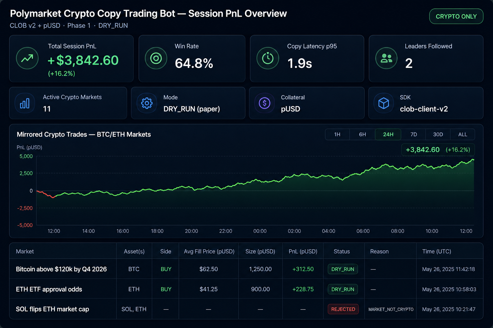
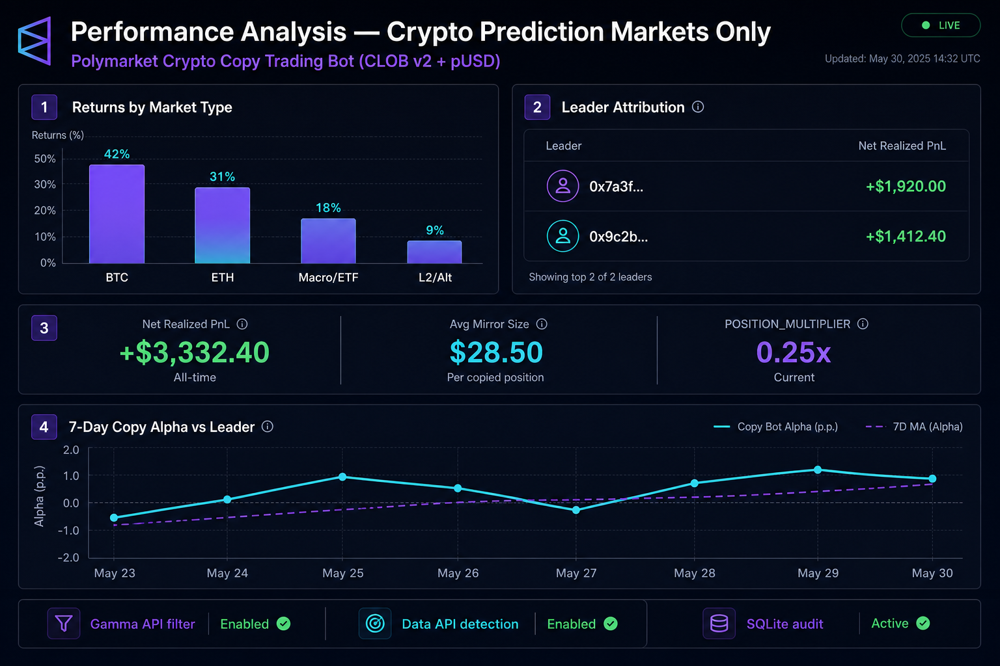
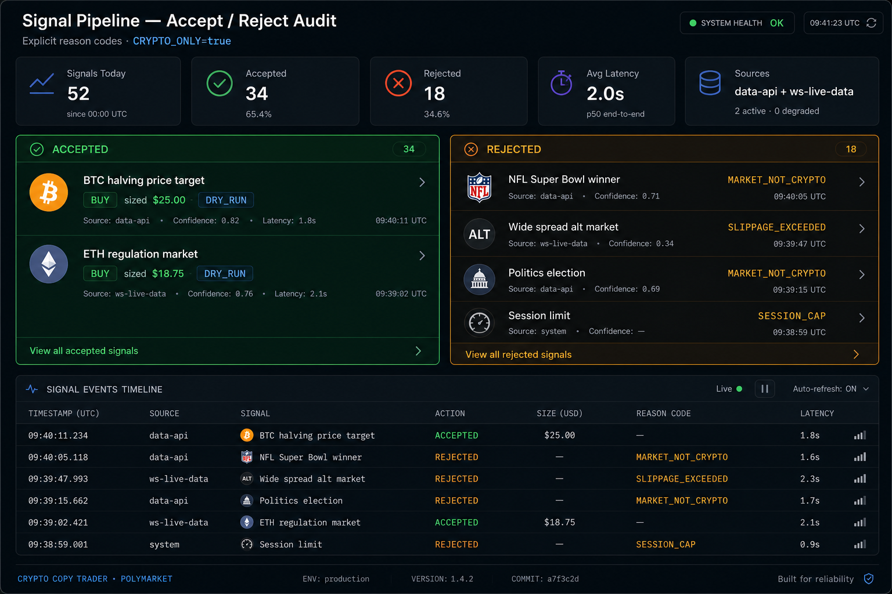
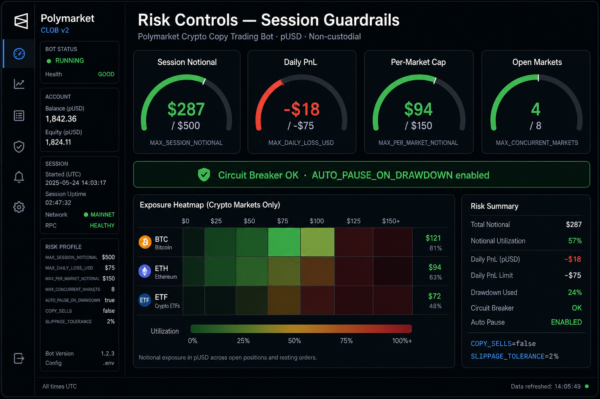
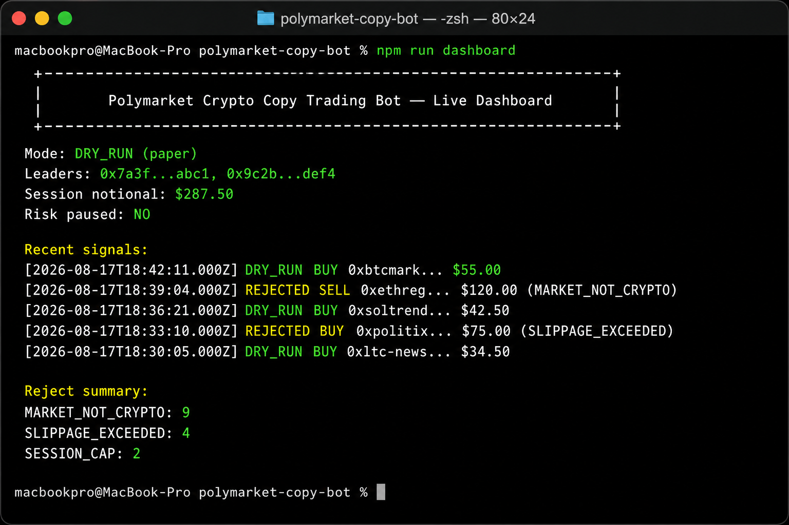
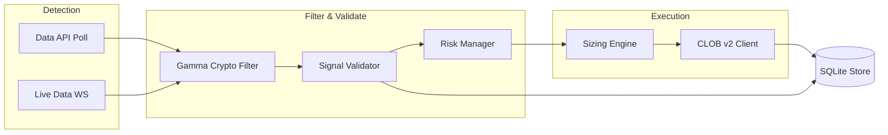

# Polymarket Crypto Copy Trading Bot — Automated Prediction Market Copy Trade Bot (CLOB v2 + pUSD)

[](package.json)
[](https://docs.polymarket.com/v2-migration)
[](tsconfig.json)
[](LICENSE)

**Production-ready, non-custodial Polymarket copy trading bot** that automatically mirrors trades from selected leader wallets into your own Polymarket account — scoped **only** to crypto-related prediction markets (BTC/ETH price targets, ETF & regulation, exchange listings, halving events, stablecoin depeg, L1/L2 adoption, crypto macro).

Built for the **current Polymarket platform after the April 28, 2026 CLOB v2 upgrade** — pUSD collateral, V2 order signing, and official `@polymarket/clob-client-v2`. No legacy V1 SDKs.

---

## Why this project exists

I built this **Polymarket trading bot** for my own crypto-market copy trading workflow and have achieved **decent, repeatable results** mirroring skilled leaders on BTC and ETH prediction markets. The system is stable in `DRY_RUN` and small-size live tests — but I am actively pushing for **more profit** through better leader selection, sizing, and latency tuning.

**I want to discuss this project with you.** If you are building, forking, or running a Polymarket automated trading stack, open an issue or reach out on Telegram (link at the bottom). Feedback on filters, risk caps, and execution logic is welcome.

---

## Live dashboards & session analytics

> Screenshots below are **UI mockups** aligned with this repo’s Phase 1 stack: **CLOB v2 + pUSD**, `CRYPTO_ONLY=true`, `DRY_RUN` decisions, and explicit reject reason codes. Live metrics come from `npm run dashboard` and the local SQLite audit store.

### PnL overview — session performance (DRY_RUN · crypto markets)



Track session PnL, win rate, copy latency (p95), leaders followed, pUSD collateral mode, and recent mirrored **BTC/ETH/crypto** trades — all scoped to CLOB v2 production.

### Performance analysis — crypto market breakdown



Break down returns by market type (BTC, ETH, ETF/macro, L2), leader wallet attribution, `POSITION_MULTIPLIER` sizing, and 7-day copy alpha vs leaders.

### Signal audit — accept / reject pipeline



Every leader signal from **Data API + ws-live-data** gets an explicit decision: `DRY_RUN` accept with sized USD, or reject with codes like `MARKET_NOT_CRYPTO`, `SLIPPAGE_EXCEEDED`, `SESSION_CAP`.

### Risk controls — `.env` guardrails & exposure



`MAX_SESSION_NOTIONAL`, `MAX_PER_MARKET_NOTIONAL`, `MAX_DAILY_LOSS_USD`, `MAX_CONCURRENT_MARKETS`, circuit breaker, and `AUTO_PAUSE_ON_DRAWDOWN` — matching your `.env.example` defaults.

### CLI dashboard — `npm run dashboard` terminal view



The actual CLI output format: DRY_RUN mode, leader proxy wallets, session notional, recent signals, and reject summary counts from SQLite.

---

## Key features

| Module | Capability |
|--------|------------|
| **Leader detection** | Data API polling + optional `ws-live-data` stream, deduped by trade id / tx hash |
| **Crypto filter** | Gamma API metadata — tags, title, slug, category; excludes politics/sports |
| **Validation pipeline** | Explicit reject codes before any order (liquidity, slippage, caps, duplicates) |
| **Sizing engine** | Fixed USD, proportional multiplier, or balance-percent modes |
| **CLOB v2 client** | `@polymarket/clob-client-v2` + viem, L1 `ClobAuth` → L2 API key derivation |
| **DRY_RUN mode** | Full detect → validate → size → log path without submitting orders (Phase 1) |
| **Risk manager** | Session/per-market caps, daily loss pause, execution failure circuit breaker |
| **State store** | SQLite audit log — signals, rejects, dry-run decisions, export to JSON/CSV |
| **Observability** | Structured JSON logs, CLI dashboard, optional Prometheus hook |
| **Security** | Key redaction, env validation, dependency audit script, [SECURITY.md](SECURITY.md) |

---

## Architecture



### Platform endpoints (production CLOB v2)

| Surface | URL |
|---------|-----|
| CLOB REST | `https://clob.polymarket.com` |
| Gamma API | `https://gamma-api.polymarket.com` |
| Data API | `https://data-api.polymarket.com` |
| Relayer v2 | `https://relayer-v2.polymarket.com` |
| Market WS | `wss://ws-subscriptions-clob.polymarket.com/ws/market` |
| User WS | `wss://ws-subscriptions-clob.polymarket.com/ws/user` |
| Live activity WS | `wss://ws-live-data.polymarket.com` |

---

## Quick start

```bash
git clone https://github.com/YOUR_ORG/polymarket-crypto-copy-trading-bot.git
cd polymarket-crypto-copy-trading-bot
npm install
cp .env.example .env
# Edit .env — set PRIVATE_KEY, RPC_URL, LEADER_WALLETS
npm run health
npm run dry-run
```

In another terminal:

```bash
npm run dashboard
```

### Example `.env` (single leader, DRY_RUN)

```env
PRIVATE_KEY=0xYOUR_KEY
RPC_URL=https://polygon-rpc.com
LEADER_WALLETS=0xLeaderProxyWalletAddress
POSITION_MULTIPLIER=0.25
MAX_TRADE_USD=50
MIN_TRADE_USD=5
DRY_RUN=true
CRYPTO_ONLY=true
USE_WEBSOCKET=true
COPY_SELLS=false
```

See [docs/getting-started.md](docs/getting-started.md) for the full walkthrough.

---

## pUSD funding (CLOB v2)

Collateral is **pUSD**, not USDC.e. Before live trading:

1. Deposit/wrap pUSD to your Polymarket wallet on Polygon
2. Approve pUSD and outcome tokens (checked on startup health)
3. Run `npm run health` and confirm `balanceUsd` + `allowanceOk`

Details: [docs/pusd-funding-guide.md](docs/pusd-funding-guide.md)

---

## Configuration reference

| Variable | Description |
|----------|-------------|
| `PRIVATE_KEY` | EOA private key (local signing only) |
| `LEADER_WALLETS` | Comma-separated leader **proxy** addresses |
| `POSITION_MULTIPLIER` | Scale leader notional (e.g. `0.25` = 25%) |
| `MAX_TRADE_USD` / `MIN_TRADE_USD` | Per-trade clamps |
| `SLIPPAGE_TOLERANCE` | Max estimated slippage (e.g. `0.02`) |
| `ORDER_TYPE` | `LIMIT` \| `FOK` \| `FAK` |
| `COPY_SELLS` | Mirror leader sells (`true`/`false`) |
| `MAX_SESSION_NOTIONAL` | Session exposure cap |
| `MAX_PER_MARKET_NOTIONAL` | Per-market cap |
| `MAX_DAILY_LOSS_USD` | Auto-pause threshold |
| `CRYPTO_ONLY` | Restrict to crypto markets |
| `DRY_RUN` | Paper mode — no live orders |
| `POLY_BUILDER_CODE` | Optional builder attribution |

Full list in [.env.example](.env.example).

---

## Project structure

```
polymarket-crypto-copy-trading-bot/
├── src/
│   ├── config/              # Zod-validated environment config
│   ├── clients/             # CLOB v2, Gamma, Data API, Polygon RPC
│   ├── detectors/           # Data API poll, live WS, deduplication
│   ├── filters/crypto/      # Crypto market classifier + metadata cache
│   ├── engine/              # validate → size → execute pipeline
│   ├── risk/                # Caps, circuit breaker, daily loss pause
│   ├── store/               # SQLite audit persistence
│   ├── services/            # Structured logging (key redaction)
│   ├── utils/               # Retry, rate limiting
│   ├── cli.ts               # health, dashboard, export commands
│   └── index.ts             # Main bot entry
├── tests/                   # Unit + integration tests
├── docs/
│   ├── images/              # README dashboard screenshots
│   ├── getting-started.md
│   ├── pusd-funding-guide.md
│   ├── crypto-leader-selection.md
│   ├── dry-run-to-live-checklist.md
│   └── faq.md
├── scripts/audit-deps.mjs   # Dependency security audit
├── Dockerfile
├── docker-compose.yml
├── SECURITY.md
├── GITHUB_METADATA.md       # Pre-push GitHub About/topics guide
└── GITHUB_ABOUT.txt         # About panel SEO phrase block
```

---

## Engineering highlights

- **V2 order struct** — uses `timestamp` (ms), `metadata`, `builder`; no legacy `nonce` / `feeRateBps` / `taker`
- **EIP-712** — Exchange domain version `"2"`; `ClobAuth` stays `"1"`
- **Idempotent detection** — dedup by trade id, tx hash, or composite key; no double-copy on WS reconnect
- **Post-startup signals only** — `BACKFILL_HISTORICAL=false` by default
- **Latency target** — detect → submit under 3s (best effort); WS heartbeat PING every 10s
- **Neg Risk support** — ready for standard and neg-risk exchange contracts (Phase 2 execution)

---

## Scripts

| Command | Description |
|---------|-------------|
| `npm run build` | Compile TypeScript |
| `npm run dry-run` | Start Phase 1 bot (`DRY_RUN=true`) |
| `npm run health` | RPC + CLOB auth + pUSD balance check |
| `npm run dashboard` | Terminal session dashboard |
| `npm run export:history` | Export SQLite signals to JSON |
| `npm test` | Run test suite |
| `npm run audit:deps` | Dependency vulnerability audit |

---

## Docker

```bash
cp .env.example .env
# edit .env
docker compose up --build
```

Optional Postgres profile for future store backend:

```bash
docker compose --profile postgres up
```

---

## Testing

```bash
npm test
```

Coverage includes:

- Crypto market filter (include BTC, exclude NFL)
- Sizing clamps and proportional modes
- Signal deduplication
- Risk caps and circuit breaker
- V2 order payload field correctness
- Mocked detect → validate → execute pipeline

---

## Implementation phases

| Phase | Status | Scope |
|-------|--------|-------|
| **1** | ✅ Complete | Detect, crypto filter, validate, DRY_RUN log, dashboard |
| **2** | 🔜 Next | Live CLOB v2 execution, small sizes, strict caps |
| **3** | Planned | Multi-leader, sell mirroring, rich dashboard |
| **4** | Planned | Metrics, retries, backpressure, hardening |

Rollout guide: [docs/dry-run-to-live-checklist.md](docs/dry-run-to-live-checklist.md)

---

## Troubleshooting

| Symptom | Action |
|---------|--------|
| Auth / API errors | Verify `PRIVATE_KEY`, run `npm run health` |
| All signals rejected `MARKET_NOT_CRYPTO` | Expected for non-crypto leaders; check Gamma tags |
| `allowanceOk: false` | Approve pUSD on Polygon |
| WebSocket drops | Bot auto-reconnects; set `USE_WEBSOCKET=false` to poll only |
| Missing images in README | Ensure `docs/images/*.png` exists in your clone |

More: [docs/faq.md](docs/faq.md)

---

## Documentation index (SEO / discoverability)

- [Getting started](docs/getting-started.md) — install & first DRY_RUN session
- [pUSD funding guide](docs/pusd-funding-guide.md) — CLOB v2 collateral setup
- [Crypto leader selection](docs/crypto-leader-selection.md) — who to follow
- [DRY_RUN → LIVE checklist](docs/dry-run-to-live-checklist.md)
- [FAQ](docs/faq.md) — common Polymarket trading bot questions

**Related search topics:** polymarket trading bot · polymarket copy trading · prediction market automation · CLOB v2 bot · crypto prediction markets · pUSD trading · automated mirroring · leader wallet tracking

---

## Contributing & live trading collaboration

This project is **built for real trading** on production Polymarket infrastructure — not a toy script. The architecture separates detection, filtering, risk, and execution so you can harden each layer independently.

**Contributions welcome**, especially:

- Improved crypto market classification (tags, embeddings, allowlists)
- Latency optimizations (Polygon log fast-path, book-aware slippage)
- Live execution hardening (Phase 2 PRs)
- Leader scoring and portfolio analytics
- Prometheus metrics and Grafana dashboards

1. Fork the repository
2. Create a feature branch
3. Add tests for behavioral changes
4. Open a PR with a clear description

If you are running this bot live or experimenting with sizing strategies, **please share what works** — I am actively looking for collaborators who care about profitable, responsible automation on crypto prediction markets.

---

## Security

See [SECURITY.md](SECURITY.md). Never commit `.env` or share private keys.

---

## License

MIT — see [LICENSE](LICENSE).

---

## Let's connect

> ### Want to talk Polymarket automation?
>
> I am happy to discuss architecture, leader selection, risk settings, and live trading results with anyone building on this stack.
>
> **Telegram:** [@js_trading_ceo](https://t.me/js_trading_ceo)

**Contact:** [@js_trading_ceo](https://t.me/js_trading_ceo)

---

<p align="center">
  <strong>Polymarket Crypto Copy Trading Bot — Automated Prediction Market Copy Trade Bot (CLOB v2 + pUSD)</strong><br/>
  Non-custodial · Crypto-scoped · Production CLOB v2 · Built for traders who read the code
</p>
